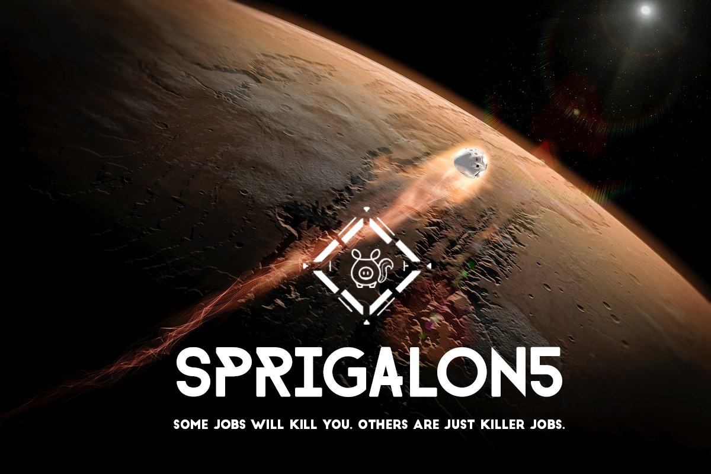

# Sprigalon5!

Sprigalon5 is an advance Python Based hiring engine that uses AI on the blockchain to actively filter applicants... by AI I mean Adams Intelligence and by Blockchain I mean a gold chain with a large block of wood that I wear around my neck... its an RPG command line game that includes the ability to find and apply for jobs at Spriggy... you will fight monsters, the elements and your own fears to either leave the planet, be rescued or die in the process.  Happy hunting. I hope you like it and I hope to work with you one day. 

## Developed by

Adam Witanowski for Spriggy

[email me](adam@spriggy.com.au) / [github](https://github.com/sprigalon5)

## Requirements

- Python3 or later (built on Python3.8)
- random module
- os
- termcolor
- pygame
- webbrowser

## Installation
- On Mac Terminal: `pip3 install -r requirements.txt`
- On Windows Command Line: `pip install -r requirements.txt`

## To run

- On Mac Terminal: `python3 sprigalon5.py`
- On Windows Command Line: `python sprigalon5.py`

## Similar projects

Nothing... this should be considered the end point that the
whole internet expriement we have been engaged in has lead to.
This is the climax of that experiment.

## How it works

| Feature | Description |
| ----------- | ----------- |
| Locations | Sprigalon5 involves traveling to and interacting with locations. Locations are dictionaries, each containing visual descriptions, interactive text, items, enemies, and references to other locations that you can travel to from here. The map is laid out in a 9X9 grid with an extra location at the far north. |
| Items | Items are appended to a list of supplies and can be used in various ways. Most items found must be worked with in the workshop() function in order to be usable. Each item found can be transformed into a useful tool (like weapons or an underwater breathing apparatus) or food. The game cannot advance without developing items, which in turn are used to develop other items. Items are distributed around the map. Once an item is observed, it is appended to the player's supplies and does not regenerate. You could also use the Ship Computer to advance the game (computer()) if you find the right resources |
| Fights | Since enemies are present, each enemy (stored as a list) is given attack power and hit points, and left in various locations around the map. Once an enemy is defeated, it is removed from the map. The fight() function is a while loop that passes a baddie as an argument and prompts the user for choices in battle; run, attack, or eat to regain health.|
| Reading | Some items can be read (read()) and this will give you extra information about how you can complete the game |
| Eating | The player's health diminishes in several ways; they can be attacked or lose strength by traveling. If the player takes too much damage from an enemy or moves around too much without returning to the ship (home base), they will die. Eating food regenerates health, but it also diminishes supplies.|
| Dying or Winning | If a player runs out of health completely, they die and the game exits. Similarly, if you defeat the final boss and gain the final item needed to complete the game, a final() function executes and ends the program successfully.|
| Alt Ending | There is a shortcut to ending the game and that is by applying for a job with Spriggy. Once you do that, a ship will come and rescue you. |

## Current bugs and possible additional developments

- None... the game is perfect as is with its warts and all.  Don't get carried away... its just a game

